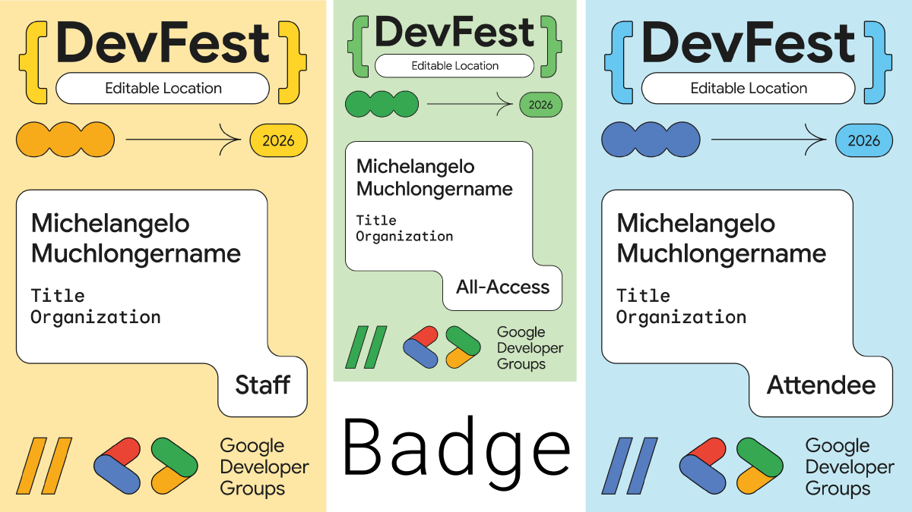

# Creador de Credenciales DevFest 2026

**Leer esto en otros idiomas:**  
[English](../../README.md) | [Español](README.es.md) | [Français](README.fr.md) | [Português](README.pt.md) | [Èdè Yorùbá](README.yo.md) | [Deutsch](README.de.md) | [Türkçe](README.tr.md) | [العربية](README.ar.md) | [हिन्दी](README.hi.md) | [日本語](README.ja.md) | [Kiswahili](README.sw.md)

DevFest Badge Creator convierte datos de asistentes en credenciales listos para imprimir de DevFest. Admite archivos CSV, XLSX y JSON, muestra una vista previa de la primera credencial válida y descarga todos las credenciales generadas en un archivo ZIP.

Aplicación en vivo: https://devfestbadge.web.app



## ¿Qué hace?

1. Sube datos de asistentes en formato CSV, XLSX o JSON.
2. Revisa la vista previa de la primera credencial generada.
3. Descarga todas las credenciales válidas en formato ZIP.

La aplicación es estática y ligera. La generación de credenciales se realiza en el navegador con Canvas, por lo que ningún archivo de asistentes se envía a un servidor.

## Formato de Datos

Archivos de ejemplo disponibles en `public/files`:
- `sample.csv` (o `public/files/es/sample.csv`)
- `sample.xlsx`
- `sample.json`

Campos recomendados:
- `ciudad` / `location` (Obligatorio)
- `nombre` / `firstname` (Obligatorio)
- `apellido` / `lastname` (Obligatorio)
- `cargo` / `title` (Opcional)
- `empresa` / `organization` (Opcional)
- `tipo` / `participationType` (Opcional: `Attendee`, `Speaker`, `General`, o `Staff`)

## Desarrollo Local

```powershell
http-server ./public -p 8082
```

Abre http://127.0.0.1:8082 en tu navegador.
